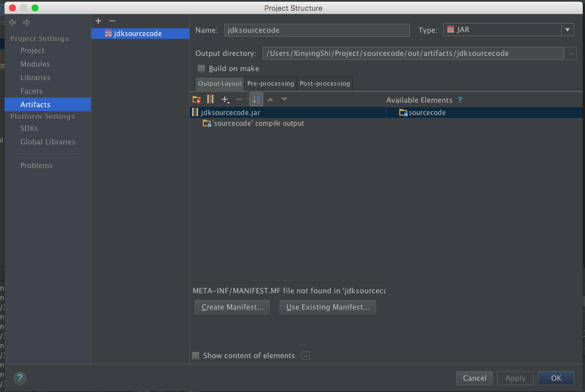

#### 导出能够 debug 的 jar 包
- 找到jdk安装路径下的源码 src.zip,复制到某个路径，并解压
- 创建一个 idea 项目，将 解压后的文件复制到 src 目录下
- 导出 jar 包
- 在 idea 中 File-->Project Structure-->Artifacts
- 点加号，生成一个 artifact

- 在 idea 中，Build-->Build Artifacts

#### 导入 jar 包

- 新建一个项目

#### 参考
https://www.cnblogs.com/zc-programer/p/9938508.html 解决debug到jdk源码时不能查看变量值的问题
https://blog.csdn.net/baidu_38760069/article/details/82900015 IDEA 导出和导入jar包教程
